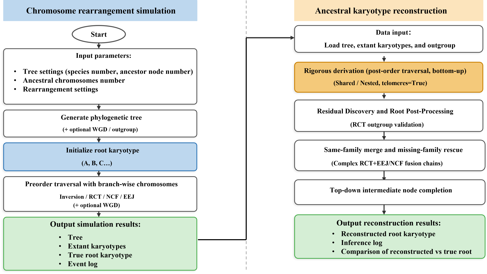

# Chromosome Evolution Simulation and Ancestral Karyotype Reconstruction

Tools for simulating chromosome evolution and reconstructing ancestral karyotypes.

## Workflow Overview



The pipeline consists of two main components:
- **Simulator**: Generates phylogenetic tree, true ancestral karyotypes, and extant species karyotypes with evolutionary events (RCT, EEJ, NCF, inversions, WGD)
- **Reconstructor**: Multi-stage inference algorithm to reconstruct ancestral karyotypes from extant species data

## Quick Start

### Install Dependencies

```bash
pip install ete3 matplotlib
```

### Basic Workflow

```bash
# 1. Run simulation
python evolution_simulator.py

# 2. Reconstruct ancestors
python ancestor_reconstruction.py

# 3. Run experiments (optional)
python experiment_table.py --no-visualize --num-scenarios 30
```

## Scripts

| Script | Purpose |
|--------|---------|
| `evolution_simulator.py` | Simulate chromosome evolution along phylogenetic tree |
| `ancestor_reconstruction.py` | Reconstruct ancestral karyotypes ([detailed guide](ancestor_reconstruction.md)) |
| `experiment_table.py` | Run batch experiments for accuracy evaluation |

## Output Files

### Simulation (`output_simulator/`)

| File | Description |
|------|-------------|
| `tree.nwk` | Phylogenetic tree |
| `tree_with_outgroup.nwk` | Tree including outgroup |
| `tree_with_ancestors.png` | Tree visualization with ancestral nodes |
| `tree_with_wgd.png` | Tree visualization showing WGD events |
| `karyotypes_species_with_outgroup.txt` | Extant species karyotypes |
| `karyotypes_true_root.txt` | True ancestral karyotype |
| `events.txt` | Branch-level event log |
| `pairwise_plots/` | Pairwise species comparison plots |
| `species_vs_ancestor_plots/` | Species vs ancestor dotplots |

### Reconstruction (`output_reconstruction/`)

| File | Description |
|------|-------------|
| `ancestors_by_node.tsv` | Per-node ancestral chromosomes |
| `ancestor_gene_sets_by_node.tsv` | Gene sets for each ancestral node |
| `reconstructed_ancestors.txt` | Reconstructed ancestral karyotypes |
| `DotPlot_ReconstructedRoot_vs_TrueRoot.png` | Comparison of reconstructed vs true root |
| `inference_log.txt` | Full reconstruction process details |

### Experiments (`output_experiments/`)

| File | Description |
|------|-------------|
| `results.tsv` | Batch experiment accuracy summary |
| `scenario_NNN/` | Individual scenario directories with copies of scripts and outputs |

## Model Assumptions

- **No gene loss**: Pipeline assumes no gene deletions/insertions during simulation and reconstruction. Coverage check warns if genes are missing.
- **Unique homology mapping**: Gene IDs are globally unique and represent one-to-one orthology across species.
- **Restricted event types**: Core events are RCT, EEJ, NCF and inversions.
- **Telomere flag**: `telomeres=True/False` distinguishes complete chromosomes from fragments, affecting strict matching and Root validation.


## Reconstruction Algorithm

Multi-stage approach implemented in `KaryotypeReconstructor.run()`:

| Stage | Method | Implementation |
|-------|--------|----------------|
| 1. Strict Inference | Shared/Nested pattern detection (postorder) | `_infer_internal_node()` → `_compare_and_merge()` |
| 2. Outgroup Validation | Iterative unmatched ancestor promotion via outgroup | `_promote_unmatched_ancestors_via_outgroup()` |
| 3. Cleanup & Merge | Species-level cleanup and cross-branch merging | `_post_outgroup_species_cleanup_and_merge()` |
| 4. Final Promotion | Promote pending root ancestors and isolated chromosomes | `_finalize_root_pending_ancestors()` + `_promote_isolated_single_chromosome()` |

### 1. Strict Inference (postorder, bottom-up)

Implemented in `_infer_internal_node()` which calls `_compare_and_merge()` for each pair of child nodes.

Two strict patterns are inferred:

- **Shared (Strict)**: Two chromosomes have identical gene sets (100% equality) and both are telomere-complete.
- **Nested (Strict)**: One chromosome's gene set is a true subset of the other, forming a contiguous block in the larger chromosome (inversions allowed; gaps not allowed).

During Nested inference, remaining genes are peeled as residue fragments and marked as `telomeres=False`.

### 2. Outgroup Validation (iterative)

Key workflow in `_promote_unmatched_ancestors_via_outgroup()`:

1. For each internal node, identify unmatched pending ancestors
2. Check if gene sets match outgroup chromosomes (with configurable thresholds)
3. Promote validated ancestors with `provenance="Outgroup-Validated"`
4. Iterate until no new promotions or root gene repertoire is complete

### 3. Cleanup & Merge (iterative)

Implemented in `_post_outgroup_species_cleanup_and_merge()`:

1. Clean up species-level redundant or overlapping chromosomes
2. Attempt cross-branch merging of compatible fragments
3. Rebuild residual pools after each iteration
4. Stop when root repertoire is complete or no new discoveries

### Telomere Flag (`telomeres=True/False`)

- **`telomeres=True`**: Complete chromosome candidates
  - Extant input chromosomes default to True
  - Strict Shared/Nested inferred chromosomes are True
  - Residual-Shared promoted chromosomes are True

- **`telomeres=False`**: Fragment residues
  - Peeled residues during Nested inference
  - Not treated as complete ancestral chromosomes

Root validated chromosomes require both: allowed `provenance` AND `telomeres=True`.

## Key Concepts

- **RCT (Reciprocal Chromosome Translocation)**: Two chromosomes exchange segments
- **EEJ (End-to-End Joining)**: Two chromosomes fuse end-to-end
- **NCF (Nested Chromosome Fragment)**: Fragment inserted into chromosome
- **Fusion Point**: Adjacent gene pair indicating chromosome fusion event
- **Lineage Isolation**: Fusion points should appear in single lineages only

## Configuration

### Simulator

```python
CONFIG = dict(
    num_modern_species=16,
    num_ancestor_chromosomes=16,
    min_genes_per_chr=100,
    max_genes_per_chr=1000,
    rearrangement_counts=dict(
        inversion_prob=0.8,
        translocation_rct=0.4,
        fusion_ncf=0.2,
        fusion_eej=0.3,
    ),
    wgd_probability=0.05,
)
```

**Note**: The phylogenetic tree is built as a strict binary tree using ete3's `populate()` method. 

### Reconstructor

```python
CONFIG = dict(
    input_tree="output_simulator/tree.nwk",
    input_karyotypes="output_simulator/karyotypes_species_with_outgroup.txt",
    input_true_root_karyotype="output_simulator/karyotypes_true_root.txt",
    output_dir="output_reconstruction",
    min_block_size=2,
    enable_cross_branch_shared=True,
    enable_cross_branch_nested=True,
    enable_conflict_check=True,
    enable_root_rct_outgroup_decision=True,
    outgroup_name="Outgroup",
)
```

## File Structure

```
karyotype-phylogenomics-simulator/
├── evolution_simulator.py
├── ancestor_reconstruction.py
├── ancestor_reconstruction.md
├── experiment_table.py
├── workflow.pdf
├── README.md
├── output_simulator/           # Simulation outputs
├── output_reconstruction/      # Reconstruction outputs
└── output_experiments/         # Batch experiment results
```

## License

Research use only.